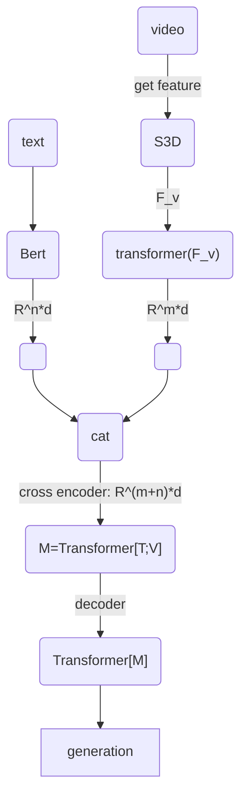

## 一、文档更新记录
### 1. 版本信息
- 版本号：v1
- 论文名称：UniVL: A Unified Video and Language Pre-Training Model for Multimodal Understanding and Generation [202002CVPR]
- 创建日期：2022.05.29
- 创建人：扶云
  
## 二、算法介绍
### 1. 核心思想

这篇文章提出了一个统一的视频和语言预训练模型，可用于多模态的理解和生成任务。它包括了

- 4个组件，其中包括 ==两个单模态的编码器，一个交叉编码器，还有一个基于transformer的解码器==。
- 5个目标，包括视频文本的联合，条件掩码语言模型（CMLM）、条件掩码帧模型（CMFM）以及视频文本的对齐，还有语言的重建。
- 两阶段的预训练策略，其中第一个是分阶段的预训练StageP，另一个是增强的视频表达EnhancedV。
- 在视频数据集`HowTo100M`上进行预训练，同时，也做了一些下游的任务，在5个下游任务上都获得了最佳的结果。

> 这里面一开始不太好理解的地方就是：整个网络设计的比较复杂，包括了4个组件，每个组件的任务要解决的问题都不太一样，另外它有5个目标，也就有了5个loss函数；它的训练过程也是分了两个阶段，所以看起来就有些复杂了。

---

> 先来看一下文章里面给的这第1张图。坦白讲，一开始也不太能看得出这一张图里面想表达啥意思，这里这些个箭头表达的意思其实并不太明确。读完这篇文章之后再回过头来看大概能理解想表达的意思是说输入模型里面的数据是视频片段和文本对，训练好这个预训练模型之后，我可以拿他来做视频字幕的生成以及通过文本来检索视频这样的一些任务。

> 所以这样子我们还不如来看第3张图，把整个模型的结构描述得相对来说比较清晰，它包括了几4个组件以及对应的5个任务。
> 同时它下面也有4个下游任务的描述，就是说拿这个预训练模型怎么去做下游的任务。其实这里很有意思啊，最近刚出来的一个CLIP这样一个算法，用对比学习来做的，跟这篇文章里提出来的前面这一部分很相似，分别有一个`text encoder`和一个`video encoder`。在这个文本和视频的联合任务里面，他其实会去算这两个输出之间的一个相似度，这就是CLIP正在做的事情，在后面CLIP的论文精度里面再进一步分析看看。

### 2. 结论
这篇文章的结论写的比较简单，总体上就是回顾了一下这个网络的设计情况，然后提到效果和精度比较好。但并没有分析论文算法的不足之处或者是可以改进的地方，最后只讲到了可能会在更大的数据集或者更多的一些下游任务上做更多的一些工作。忽略。

### 3. 实验

#### 数据集介绍
这里简单的先介绍一下，这里面会用到的一些数据集，这一块之前接触的比较少一点。每一个数据集都是用来评估不同的任务的。

1. Youcook2
   Youcook2（Zhou等人，2018a）==包含89个食谱的2000个烹饪视频，有14K个视频片段。整体时长为176小时（平均5.26分钟）==。每个视频片段都有一个字幕句子的注释
2. MSR-VTT
   是用于视频检索任务的开放域数据集。它有开放领域的视频片段，==每个片段有20个由人类标记的字幕句子。总共有20万个片段-文本对，来自10K个视频，包括体育、音乐等20个类别。==
3. COIN
   COIN（Tang等人，2019）是为了评估动作分割任务，它包含180个不同的任务和11,827个视频。每个视频都被标记为3.91step 片段。总的来说，该数据集包含476小时的视频，有46354个注释的片段。
4. CrossTask
   CrossTask（Zhukov等人，2019）是为了评估动作步骤定位任务。它包含83个不同的任务和4.7k视频。对于每个任务，都提供了一个带有人工描述的有序的步骤列表。
5. CMU-MOSI
   多模态意见情绪和情感强度（Zadeh等人，2016）是在线视频中的句子级情绪分析和情感识别。
   CMU-MOSI包含2,199个意见视频片段，每个片段都在[-3, +3]范围内用实值的情感强度注释。我们评估了我们的模型在多模态情感分析中的表现。

#### 实验结果
先介绍一下实验过程中的一些参数配置或者是具体的模型配置。

!!! summary "两个单模态配置"
    === "text-encoder"
        1. BERT-base
        2. 12 layers of Transformer blocks(每个block包含12个attention heads，隐藏层大小是768)

    === "video-encoder"
        1. S3D 模型
        2. fps: 16, dimension: 1024
        3. 6 layers of Transformer blocks(每个block包含12个attention heads，隐藏层大小是768)

采用了8块V100进行训练。训练过程分两个阶段

- 第1个阶段，batch size设置为600训练50个epoch大概需要花1.5天，lr=1e-3
- 第2个阶段, batch size设置为48，然后要训练50个epoch，大概需要12天，lr=1e-4

这里面的实验结果，主要针对5个任务分别做了分析，具体如下：
!!! summary "5个目标任务"
    === "基于文本的图像检索"
        输入一个text query，然后来检索视频片段。这有两种计算 text embedding 和 video embedding 的方式，一种是 UniVL（FT-Joint），这种方式直接通过点乘来计算相似度得分，一种是 UniVL（FT-Align），获取embedding之后会继续输入到cross encoder 中得到统一的表达，然后预测匹配得分。可以看下面这个检索结果。通过cross encoder之后的精度可以有明显提升(在MSR-VTT上差距不大)，而且相比之前的一个其他方法，精度有大幅的提升。
        

    === "多模态字幕生成"
        这里也是可以看到相比之前的一些方法，精度都得到了明显的提升，但这里的这些评估的指标的计算方式还没有进一步的去看。还是没太理解他这个transcript是啥意思。
        

    === "其他"
        其他几个目标任务的结果就不继续展开了，可以看看原论文中的几个结果table

### 4. 详细过程
这里进一步的看一下整个算法设计的具体步骤。还包含一些公式相关的推理。

整体上采用的是encoder-decoder的结构，最后decoder输出的结果是用于重建input text。这里大体上就像下面这样一个流程图，把整个的架构描述出来了，具体的过程就不再详细的看了。

接下来看一下目标函数和损失的计算。

- 目标1：video-text joint，采用了MIL-NCE loss
  
- 目标2：条件掩码语言模型
  
- 目标3：条件掩码帧模型，也是采用NCE loss，随机的mask 15%的帧（置0），这里作者说很难去重建中间的帧，不是重建，而是去判别 ground truth 和噪音这二者属于mask部分的概率。
  
- 目标4：视频文本对齐，这里左边的一项是通过一个线型的变换来得到对应视频和文本的match score，右边这一项是文本跟同一个batch其他帧之间的一个 match score.
  
- 目标5：文本重建
  
- 最后的loss是加权之和：
  

#### 训练策略

1. StageP

在第一阶段，只保留文本BERT和视频变换器，使用视频-文本联合损失公式（5）学习权重。
接下来，降低学习率，继续通过所有五个目标对UniVL进行进一步的预训练。
好处：一是加快预训练的速度，另一个是使预训练的进度对权重更加平滑。

2.  EnhancedV: Enhanced Video Representation

用15%的可能性来掩盖整个文本标记。换句话说，在每个小批次中，有15%的文本视频对有整个文本标记被屏蔽，是模型利用视频信息来完成生成。这样学习到的视频表示效果会更好。

### 5. 应用场景

也就是上面的5个下游任务了。

### 6. 附图
这篇文章没有给出一些效果的图，主要就是一些精度的结果。这块可能需要跑一下代码才能看到效果了。

## 三、附件
[原始论文](https://arxiv.org/pdf/2002.06353.pdf)

[github](https://github.com/microsoft/UniVL)