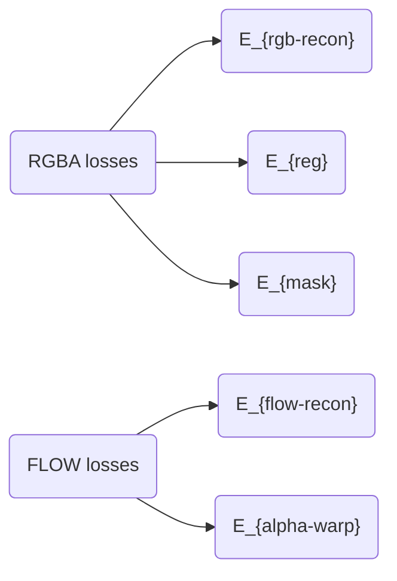
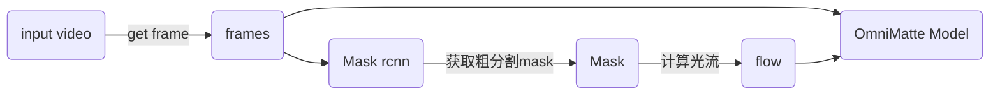

## 一、文档更新记录
### 1. 版本信息
- 版本号：v1
- 论文名称：Omnimatte: Associating Objects and Their Effects in Video [CVPR 2021 Oral]
- 创建日期：2022.06.05
- 创建人：扶云

## 二、算法介绍
### 1. 核心思想
这篇文章主要的出发点是，考虑到现在大多数的图像分割中并没有考虑目标附带的一些效果，例如阴影、反射、烟雾等等，这篇文章的目的，就是为了解决这样一个问题，希望通过输入一个普通的视频，以及一个或者多个感兴趣的目标对象随时间变化的（粗分割）mask，为每个对象估计一个全像-omnimatte（一个包括该对象及其所有相关的时间变化的场景元素的阿尔法遮罩和彩色图像）。

1. 在输入视频上以自我监督的方式进行训练，没有任何人工标签。为任意物体和各种效果自动产生全像。
2. 展示了真实世界视频的结果，其中包含不同类型的主体（汽车、动物、人）和复杂的效果之间的互动，从半透明的元素，如烟雾和反射，到完全不透明的效果，如连接到主体的物体。

> 看下面这张图就可以看出来，输入是一个原始的图像帧（序列），以及对应目标（人、狗、车等）的粗分割mask，输出则是将目标与其相关的效果（阴影、烟雾、倒影等）自动匹配上之后的mask 和 RGB前景。非常的amazing.


### 2. 结论和展望

#### 不足

> 作者在前面的方法中，他采用了一个单应性矩阵（homographies）来估计背景的一些微小的变化，但是当这个矩阵不能完全准确地代表背景的时候，就会出现一些错误。

1. 背景的估计不一定完全准确
2. 无法分离那些在整个视频中相对于背景完全静止的物体或效果。这些问题可以通过建立一个明确地模拟场景三维结构的背景表示来解决（例如[4]）
3. 作者观察到，网络权重的不同随机初始化可能偶尔会导致不同的，有时是不理想的解决方案。他们推测，通过进一步优化帧被引入模型的顺序，可以获得更可靠的收敛效果


### 3. 实验
#### 数据集介绍
这个论文里面涉及到的实验数据主要是他们从一些视频里面挑出来的视频片段做了效果的测试，然后跟之前算法的效果进行对比，大部分没有量化的评估。其中只是在背景剪除这个实验上，在CDW-2014数据集上做了一个量化的对比，但是这个数据集我没有找到通用的一些实验介绍。
#### 实验结果
作者针对这个算法的应用场景，针对性的做了比较丰富的一些实验。

##### ⅰ、真实视频上定性的示例
图3显示了我们在DAVIS[23]、CDW2014[36]（见第4.4节）和从YouTube下载的各种真实世界的视频上估计的全息图的例子。这些例子跨越了广泛的动态主体（例如，人、动物或一般的移动物体，如足球），执行复杂的动作并产生各种场景效果，包括阴影、反射、水波纹、灰尘和烟雾。输入的物体遮罩都不包括这些效果（见图3（b））。

##### ⅱ、对象擦除

我们的方法可以应用于从视频中移除动态物体，方法是：(i)将我们的全息图二值化，并将其作为单独的视频补全方法（如`FGVC[11]`）的输入，或者(ii)简单地将物体的全息图层从我们的重建中剔除。

一般，去除一个物体但不去除其相关的效果会产生一个不现实的结果（物体被去除但其阴影仍然存在）。通常情况下，这样的效果是由人工注释的，以创建一个保守的二进制掩码来移除区域（图4（c））。为了证明全能工具可以取代人工编辑，我们通过 ==将我们的软阿尔法阈值定为0.25并扩张20个像素来得出一个二进制掩码== ，并将其输入到FGVC[11]。图4(c)显示马和它的影子都被去掉了，表明我们得出的遮罩与手工注释的遮罩相媲美。

图5显示了全局去除（上述方法（二））和FGVC使用手工遮罩的比较。在火烈鸟的例子中，我们的方法不仅去掉了火烈鸟，而且还去掉了它在水面下的反射。

FGVC依靠的是不包括反射的遮罩，因此反射在他们的结果中保持不变。我们的全息图避开了手动标记这种半透明的东西的需要。

> 这里展示了两种对象擦除的方法，第1种方法是通过将本论文输出的mask图赢分割之后输入到当前SOTA的对象擦除算法（FGVC）中，这里只利用了输出的mask信息，跟原FGVC手动生成的mask效果可比，
> 第2种方法是直接采用本论文生成的合成的背景图片当做对象擦除之后的结果，效果也跟之前手动选定mask之后擦除目标的结果可比，甚至更好（水中倒影）。


##### ⅲ、阴影检测的对比


我们展示了与最新的 ==阴影检测方法ISD[34]== 的定性比较，ISD是一种基于深度学习的方法，将RGB图像作为输入，并产生物体-阴影对的片段。ISD集成了一个类似MaskRCNN的物体检测阶段（Detectron2[38]），因此它不需要或不允许输入掩码。

图7比较了我们与ISD在两个具有挑战性的场景中的结果，其中一个人的影子投射到另一个物体（长椅）上，以及一个人的影子被另一个物体（一只狗）遮挡住。我们的方法在这两种情况下都成功地处理并超过了ISD。 ==遮挡和投射在其他物体上的影子对于ISD等纯数据驱动的方法来说是特别困难的，因为影子的外观取决于场景中多个物体的相对配置。== 

> 这里挑选了一个影子投射在长椅上的场景进行了对比，体现出本文的算法比直接做阴影检测的效果会更好一些，在遮挡或者投影这样的一些场景上面。


##### ⅳ、背景减除的对比
在CDW-2014这个数据集上定量的评估了在背景减除任务上的效果。采用了 `Jaccard index (J ) and Boundary measure (F)` 来评估。


##### ⅴ、与分层神经渲染的对比

图 10 显示了与 Lu 等人的人类特定的分层神经渲染方法的定性比较。 [18]。
在 [18] 中，使用表示每个人的几何形状的 ==每帧 UV 贴图== 和表示外观的 ==每人可训练纹理贴图== 来对人进行参数化。

相反，我们使用二进制掩码和预先计算的光流来表示对象区域（参见第 3 节）。为了比较，我们使用了从它们的 UV 图中提取的二进制掩码。【直接从uv图生成的mask】

在这两个例子中，我们的方法都取得了与 [18] 相当的结果，成功地捕获了蹦床变形、阴影和反射，但`输入更通用、更简单`。在遮挡情况下表现也更好。

> 这里其实就是拿了一些其他的能对人进行估计的算法来进行对比论证本文算法的一个优势和效果。
> 下面这个图里面对蹦床这个场景的效果确实很好，基本上把蹦床的形变也处理了。


### 4. 详细过程
首先，basemodel是一个`2D-Unet`。【目前看，前处理的过程比较多】

1. 将目标分成N个mask layers【分组，例如骑车的人，这里怎么分组的？】
2. 计算密集光流场$F_t$
3. 对齐所有的帧到共同的坐标系

模型infer的信息:

1. omnimattes- mattes 和 RGB图像对，包括空间和时间上与之相关的所有场景元素
2. 每个层的精确光流场【refine之后的】
3. 背景RGB图像

下面这个公式就是输入和输出的一些信息定义：


> 参考下面这张图中的整体结构


#### loss 定义
> 整个系统里面这个loss的定义比较复杂。

训练损失由RGBA输出（第3.2节）和预测flow（第3.3节）的部分组成。

1. 主要的损失是重建损失$E_{rgb-recon}$，但由于重建对多层的约束不足，
2. 我们对 $\alpha$ 层增加了一个稀疏性正则化$E_{reg}$，对掩码增加了一个初始化损失$E_{mask}$，类似于[18]。
3. 我们通过增加一个流动重建损失$E_{flow-recon}$、及对$\alpha$ mattes 增加一个时间一致性项 $E_{alpha-warp}$ 来鼓励结果的运动与输入相匹配。

整体的loss就如下所示，加权：




展开loss：

!!! summary "5个目标任务"
    === "$E_{rgb-recon}$"
        这里主要是重建图像的L1 loss。

    === "$E_{reg}$"
        为了防止一个layer就构建出原始帧，这里需要对$\alpha$加正则（近似L0和L1正则的混合loss）。
        ```python
        def cal_alpha_reg(prediction, lambda_alpha_l1, lambda_alpha_l0):
            """Calculate the alpha regularization term.

            Parameters:
                prediction (tensor) - - composite of predicted alpha layers
                lambda_alpha_l1 (float) - - weight for the L1 regularization term
                lambda_alpha_l0 (float) - - weight for the L0 regularization term
            Returns the alpha regularization loss term
            """
            #    assert prediction.max() <= 1.
            #    assert prediction.min() >= 0.
            loss = 0.
            if lambda_alpha_l1 > 0:
                loss += lambda_alpha_l1 * torch.mean(prediction)
            if lambda_alpha_l0 > 0:
                # Pseudo L0 loss using a squished sigmoid curve.
                l0_prediction = (torch.sigmoid(prediction * 5.0) - 0.5) * 2.0
                loss += lambda_alpha_l0 * torch.mean(l0_prediction)
            return loss
        ```

    === "$E_{mask}$"
        这里主要是重建图像的L1 loss。
        是一个边界腐蚀损失，先计算 trimap(这里实际就是输入的mask？) 和预测$\alpha$的L1 loss，然后计算边界差异的loss

        ```python
        mask_err = nn.L1Loss(prediction, target)
        pos_mask = F.relu(target)
        neg_mask = F.relu(-target)
        pos_mask_loss = (pos_mask * mask_err).sum() / (1 + pos_mask.sum())
        neg_mask_loss = (neg_mask * mask_err).sum() / (1 + neg_mask.sum())
        loss = .5 * (pos_mask_loss + neg_mask_loss)
        return loss
        ```

    === "$E_{flow-recon}$"
        这个跟上面的RGB重建损失类似，L1 loss
    
    === "$E_{alpha-warp}$"
        这里是对 $\alpha$ wrap做了一个限制，对t+1时刻第i层的$\alpha$采用t时刻预测出来的 flow 进行变换（wrap），得到 $\alpha_{wt}^i$，这里尽量约束两个时刻的$\alpha$ 具有时间的一致性。【这项loss默认权重很小，0.005】

        


> 整个流程看下来，太多的工程化在里面了，超参数也非常多。←_←

实现的粗略流程


### 5. 应用场景
可以帮助各种应用，如删除、复制或增强视频中的物体。

## 三、附件
[原始论文](https://arxiv.org/abs/2105.06993)

[github](https://github.com/microsoft/UniVL)

