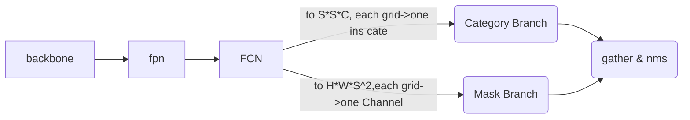

## 一、文档更新记录
### 1. 版本信息
- 版本号：v1
- 论文名称：SOLO: `S`egmenting `O`bjects by `Lo`cations [201912ECCV]
- 创建日期：2022.06.26
- 创建人：扶云
## 二、算法介绍
### 1. 核心思想

1. 提出了一种新的、简单得令人尴尬的实例分割方法；
2. 引入`“实例类别”`的概念，根据实例的位置（location）和大小（size）将类别分配给实例中的每个像素，从而很好地`将实例分割转化为一次性分类可解决`的问题；
3. 具有很强的性能，达到了与Mask R-CNN相当的精度，并且在精度上优于最近的single shot实例分割器

实例分割一般做法：

1. `top-down`: 遵循“检测然后分段”策略(例如，mask R-CNN)
2. `bottom-up`: 先预测embedding层向量，然后使用聚类技术将像素分组到各个实例中

直接看下算法的结构：

!!! note
    1. 直接根据位置和大小来区分不同的实例，所以前置不需要检测box，也不需要后面来做聚类。
    2. 一个grid cell 负责预测一个 实例（前提条件，也是假设），多个相邻的mask channel来预测一个实例的mask，最后做nms。

### 2. 结论和展望

1. 端到端训练
2. 简单、灵活，且性能强大
3. 推理事件恒定

后续可以展开的点：
todo

### 3. 实验
#### 数据集介绍

1. {++coco 2017++}：在5k val2017做了消融实验

训练细节：

SOLO是用随机梯度下降(SGD)训练的。在8个GPU上使用sync SGD，每个mini-batch含16张图像。除非另有说明，所有模型都以0.01的初始学习率训练36个epoch，然后在第27个epoch除以10，并在第33个epoch再次除以10。使用0.0001的权重衰减和0.9的动量。所有模型都从ImageNet预训练权重初始化。使用缩放抖动（scale jitter），其中较短的图像边从640到800像素随机采样。

#### 实验结果

1. SOLO用ResNet-101实现了一个mask AP 37.8%，是现有的两阶段实例分割方法(如Mask R-CNN)中的最优水平；
2. SOLO优于所有以前的一阶段方法，包括TensorMask [4]；

#### 消融实验

`grid number`

不同的S取值，对整体精度的影响，以及加入多尺度（5层特征金字塔）之后，AP+6.8%。

`CoordConv`：空间敏感卷积

普通卷积能学到一定的空间信息，但这种隐式学习到的位置信息粗糙且不准。所以这里借鉴了(CoordConv [17])，将额外的坐标channel concat到特征map上，AP+3.6%。

`损失函数`

1. 比较了3个不同的损失：传统的二元交叉熵(BCE)、focal loss(FL)和dice loss(DL).
2. focal loss 比BCE效果要好，因为实例mask的大多数像素在背景中，并且focal loss被设计成通过减少良好分类的样本的损失来减轻样本不平衡问题；（通过仔细调整平衡超参数并引入其他训练技巧，二元交叉熵和FL的结果可能会得到相当大的改善？但并未确认）
3. dice loss实现了最佳结果，且无需手动调整损失超参数。Dice Loss将像素视为一个整体对象，可以自动在前景和背景像素之间建立正确的平衡。
4. 为了进行公平的比较，我们还在补充中显示了具有dice loss的mask R-CNN的结果，其性能比原始BCE loss更差(-0.9AP)。【不存在不均衡的问题】

`类别分支对齐问题`

在类别预测分支中，我们必须匹配空间大小为H×W到S×S的卷积特征。这里，对比了三种常见的实现方式:插值、自适应池化和区域网格插值。

根据我们的观察，这些变量之间没有明显的性能差距(±0.1AP)，表明align过程对最终精度没有显著影响。

#### 错误分析

为了定量地理解掩蔽预测的SOLO，我们通过用真实值替换预测的mask来执行误差分析。对于每个预测的二进制掩码，我们用gt mask计算iou，并用最重叠的gt mask替换它。如表7所示，如果我们用gt mask替换预测掩码，AP将增加到68.1%。这个实验表明，mask分支还有很大的改进空间。

==改进方向==：(a)在语义分割方面优化，(b)用于处理遮挡/微小对象的技术能够被应用来提高性能。

!!! note
    意思是目标的检测和定位已经比较好了，改进mask就可以得到大幅的ap提升，所以这块还有很多可以做的。

### 4. 详细过程

SOLO框架的中心思想是将实例分割重新定义为两个同时的类别感知预测问题。具体而言，我们的系统将输入图像划分成统一的网格，即S×S。如果对象的中心落入网格单元，则该网格单元负责

1. 预测语义类别：head部分输出$S*S*C$的map，每个grid 的cell，C个channel最多有一个分类，这里假定了一个grid最多预测一个类别；
2. 分割该对象实例：每个positive grid cell 会生成一个对应的实例 mask。所以对 S * S 个grid，会输出 $H_I*W_I*S^2$ 维度的output，$k^{th}$channel 对应上面语义类别的$(i, j)$，满足$k=i*S+j$。

> 确认了类别，和mask，就获得了最后的实例分割结果

==如何预测实例mask？==

直接的想法就是利用类似FCN的结构，但FCN对空间位置不敏感，采用`CoordConv`来加入位置敏感信息【直接加入归一化的像素坐标】，参考下图：

> 2个head除了最后一个conv其他层都是共享参数的。

初始的实例分割结果就是汇聚所有的grid 预测结果，然后进行nms。

##### label assignment

当，grid (i,j) 落在任何gt mask 的center 区域的时候，被认定为一个positive sample，否则为负样本。

`center 区域的定义`：计算质心$(c_x, c_y)$，然后取一个中心区域$(c_x, c_y, \alpha w, \alpha h), \alpha=0.2$ by default。这样算下来，平均每个gt会对应3个positive sample。

> 关于 $S^2$ 个channel 与 $S*S$grid对应顺序的问题，目前看影响不大，按行的顺序即可。

##### loss function

损失函数定义如下：

$$L=L_{cate} + \lambda L_{mask}$$

比较常规的加权loss，$L_{cate}$一般为传统的Focal loss，$L_{mask}$如下：

其中$N_pos$是正样本总数，k 代表第k个channel【给定S的情况下，对应的可以算出i 和 j】，$p^*_{i,j}$代表(i,j)处如果是一个实例就>0，否则=0. $d_mask$就是两个mask之间的距离或者损失度量了。

这里实现了3个版本，1. BCE，2.Focal loss，3. Dice loss。最后选择了dice loss，效果最好且最稳定。

##### decouple【AP+0.6%】

以S=20为例，会输出400个channel，大部分情况下目标比较稀疏，所以矩阵会很冗余。所以相比普通的SOLO head，这里额外改进了一个解耦的head，原先是输出$H*W*S^2$，解耦x和y之后，输出就是$H*W*2S$，一个x branch 一个 y branch，所以这里的mask输出：

$$mask_{instance} = map_{xj} * map_{yi}$$

$map_{xj}$和$map_{yi}$分别是 X和Y 的 $j^{th}$ 和 $i^{th}$ channel，元素相乘。

### 5. 应用场景
实例分割，目标轮廓识别。

### 6. 附图

## 三、附件
https://arxiv.org/abs/1912.04488

https://github.com/WXinlong/SOLO