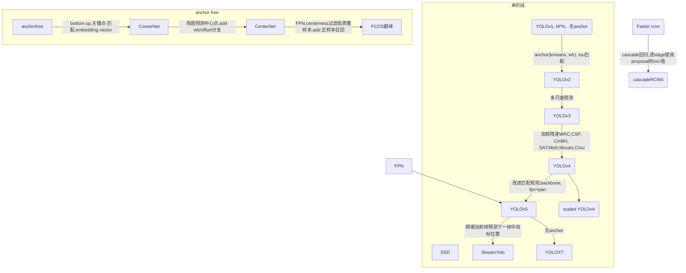
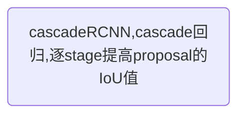
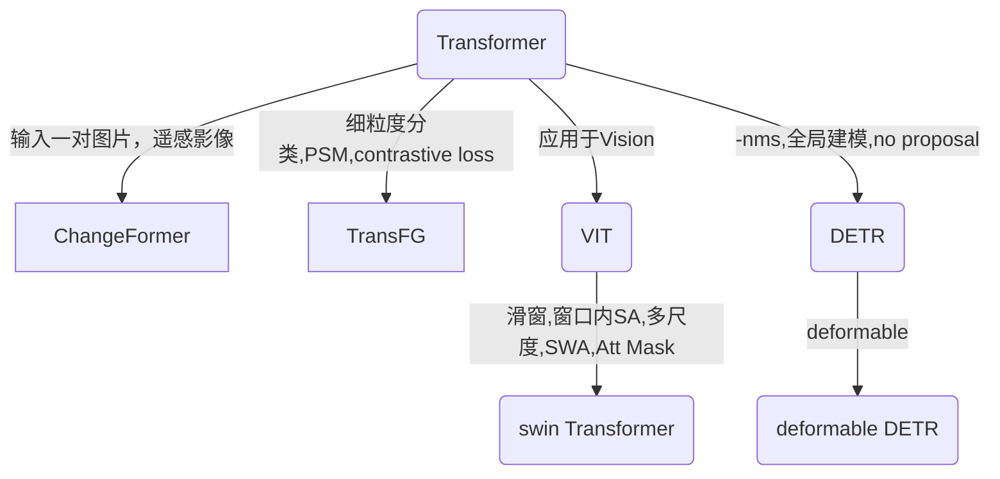
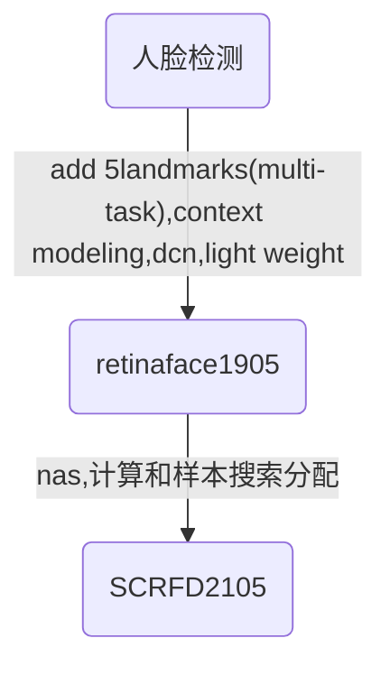
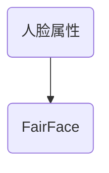
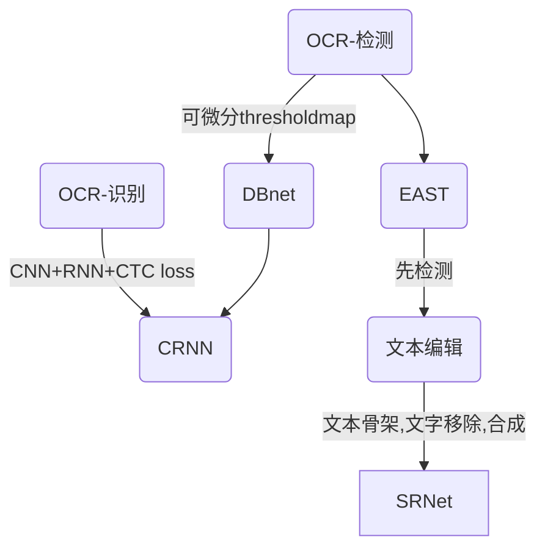
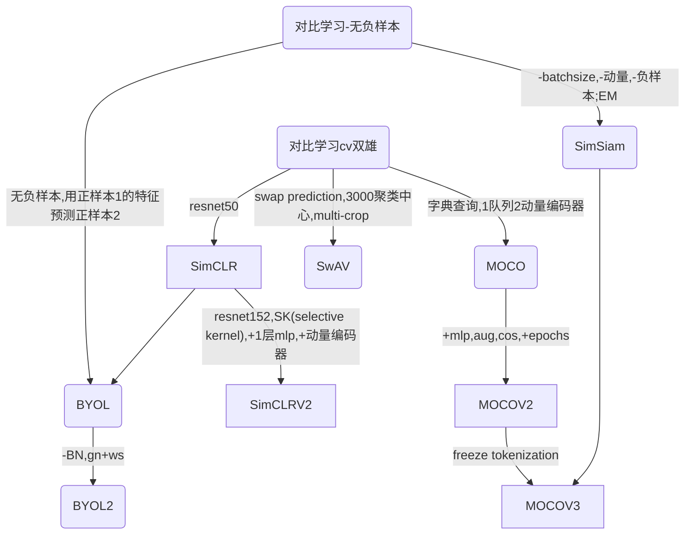
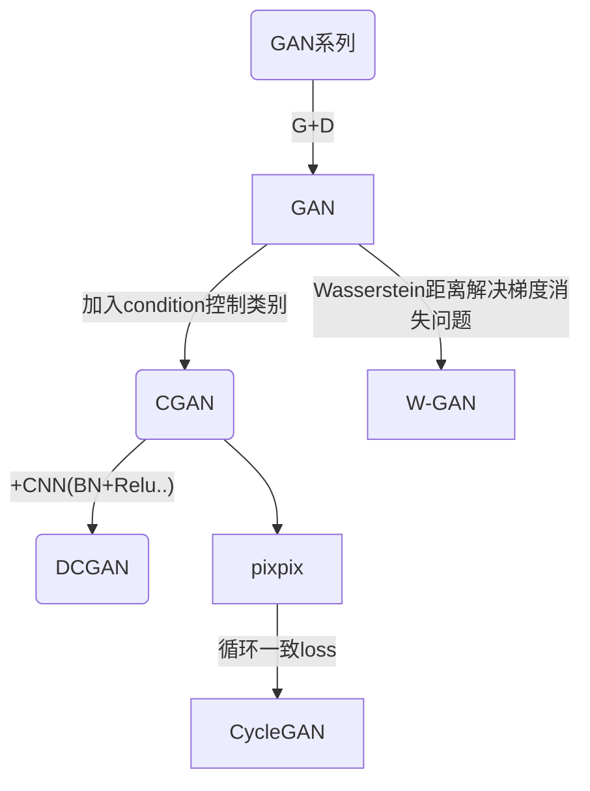

#### 目标检测 系列


#### 级联目标检测 系列



#### 分割 系列

- 先占坑


``` mermaid
graph TD
    %% segmentation
    
```


#### transformer 系列

- DETR[202005]：端到端的目标检测，no anchor/nms，提出了一个新的基于集合的目标函数；限制输出100个框，直接限制阈值；【主要还是 transformer 的全局特征提的很好】
  - 小目标效果不好
  - 500epoch
  - 采用object query来替代了anchor机制
  - 利用二分图匹配来替代nms




#### 人脸 系列

---


#### OCR 系列


#### 对比学习 系列

- 无监督学习，训练越久模型越大一般效果也确实越好。
- 负样本一定要多

趋势：

- 目标函数：infoNCE或者相关变体
- 模型：一个encoder + mlp prjection head
- 数据增强：更强大的aug
- 动量编码器
- 训练时间更长, 更大的batch size

`multi-crop:` 改变只有1+1两个正样本对的情况，多加一些小尺寸Crop，在保证计算量不大幅增加的同时，增加全局和局部的view，有效提点。




一张图总结所有。


#### GAN 系列




